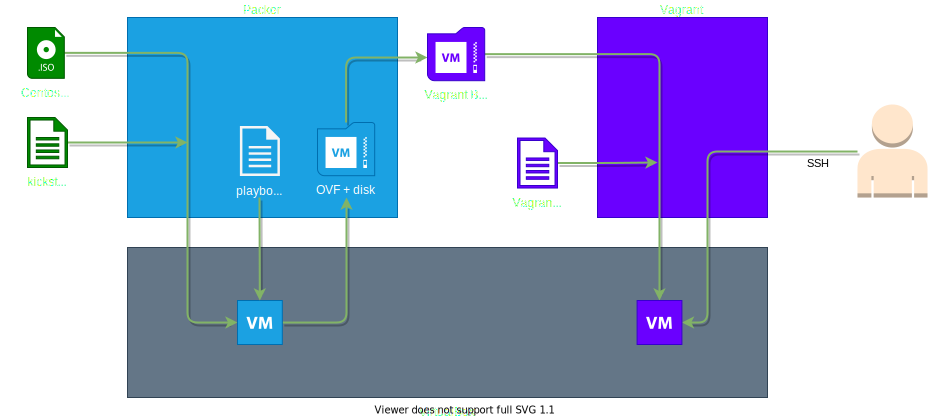

# Description
Packer setup to create VirtualBox-based Centos 8 Stream images for Vagrant.

# Pre-requirements
- VirtualBox, Packer and Vagrant are installed.

# Overview

# HOWTO: Build the box

1. Navigate to the packer folder
2. Edit centos-8-stream.pkr.hcl and configure _iso_url_ to point to the centos-8-stream.iso. For example:  
`iso_url = "file://P:/images/CentOS-Stream-8-x86_64-latest-dvd1.iso"`
3. Start the Packer build with:  
`packer build centos-8-stream.pkr.hcl`
4. Created images and boxes will be placed in: _packer/packer\output-centos-8-stream-builds_
5. Navigate to the vagrant folder
6. Start the Vagrant box with:  
`vagrant up`
7. Connect to the Vagrant box with:  
`vagrant ssh`

# Roadmap / ideas / improvements:
- [ ] variables section
  - [ ] with booleans to toggle for easy config
- [ ] secrets cleanup
- README
  - [ ] HOWTO: build + run
  - [ ] introduction
  - [ ] draw.io
- packer
  - [ ] config via root with ssh and pw, install python for ansible, create ansible user with key and sudo!, disable ssh for root!
- vagrant 
  - [ ] user ssh key
  - [ ] user without password in vagrantfile
  - [ ] user nopasswd
- multiple builds
  - [ ] minimal 
  - [ ] full
  - [ ] gui build
- [ ] basic configuration with ansible playbook
- [ ] Publish box(es) to artifact repo

