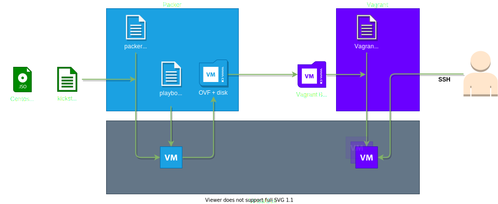

# Description
Packer setup to create a VirtualBox-based Centos 8 Stream images for Vagrant under Windows.

# Requirements
- VirtualBox, Packer and Vagrant are installed under Windows.

# Overview

# HOWTO: Build the box

1. Navigate to the packer folder
2. Edit the `variables.pkr.hcl` and `packerfile.pkr.hcl` to fit your needs.
3. Start the Packer build with:  
`packer build .`
4. Created images and boxes will be placed in: `<packer_folder>/builds/`
5. Navigate to the vagrant folder
6. Start the Vagrant box with:  
`vagrant up`
7. Connect to the Vagrant box with:  
`vagrant ssh`

# Roadmap / fixes / improvements:

- packer
  - update all except kernel*
- vagrant variables-file
- kickstart root pw rorate in provisioning
  - 1 weak temporary root password that only exists while building the image
  - rotating password: pw as variable in packerfile, expose to provision script via provisioning command for script? 
- update README + svg + clean packer_cache! + vagrant box remove
- Rebuild/Fork project to work with a cloud provider so continue developing after swithc to Macbook M1?

# Changelog:
- v0.2
  - packer:
    - added variables and variables.pkr.hcl file
  - vagrant:
    - updated to match changes in packer configuration
  - general:
    - streamlined filenames and cleaned up project files
- v0.1
  - packer:
    - fixed Oracle VirtualBox Guest Additions not working/installing
    - installer now runs in text-based mode instead of graphical mode
    - removed vagrant user from kickstart.cfg
    - the build will keep the OVF+disk file that are used to create the vagrant box file
    - provisioning will no longer update ALL packages
  - vagrant:
    - fixed Vagrant shared folder
- v0.0
  - init (see commits)
