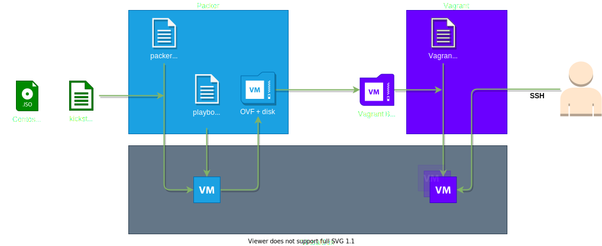

# Description
Packer setup to create a VirtualBox-based Centos 8 Stream images for Vagrant under Windows.

# Requirements
- VirtualBox, Packer and Vagrant are installed under Windows.

# Overview

# HOWTO: Build the box

1. Navigate to the packer folder
2. Edit centos-8-stream.pkr.hcl and configure _iso_url_ to point to the centos-8-stream.iso. For example:  
`iso_url = "file://../../images/CentOS-Stream-8-x86_64-latest-dvd1.iso"`
3. Start the Packer build with:  
`packer build centos-8-stream.pkr.hcl`
4. Created images and boxes will be placed in: _packer-centos8stream-vagrant-basic-box/packer/output-centos-8-stream-builds/..._
5. Navigate to the vagrant folder
6. Start the Vagrant box with:  
`vagrant up`
7. Connect to the Vagrant box with:  
`vagrant ssh`

# Roadmap / fixes / improvements:

- Variables:
  - convenience
  - secret management
- packer
  - multiple build types
- Vagrant
  - local box versioning
  - multi box setup
- Publish to artifact repo
- CI/CD

# Changelog:
- v0.1 - 19 jan 2022
  - packer:
    - fixed Oracle VirtualBox Guest Additions not working/installing
    - installer now runs in text-based mode instead of graphical mode
    - removed vagrant user from kickstart.cfg
    - the build will keep the OVF+disk file that are used to create the vagrant box file
    - provisioning will no longer update ALL packages
  - vagrant:
    - fixed Vagrant shared folder
- v0.0
  - init (see commits)
